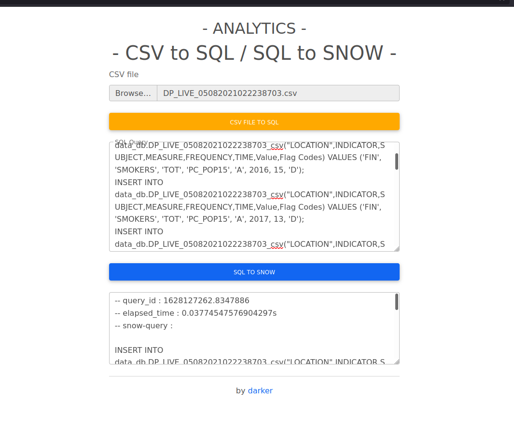

# SQL-query To SnowFlake-query

This is a dump project i wrote just to not have to learn again the SnowFlake based DDL synthax,
am not the author of the function inside `./utils.py`, 
[tamiroze](https://gist.github.com/tamiroze/dc0bdd596ed2c6b70fe921061401e739) is !

But like you have probably noticed, his version need to be run on a terminal with sql queries insides sql files...

boring.... so i wrapped everything inside a basic flask UI application, and i added some coul stuffs !

That's all, yeah, nothing special.



## How to install

```shell
# Set up your environment:
vitualenv -p python3 env
source env/bin/activate

# then install requirements
pip install -r requirements.txt
```

## How to start
```shell
python3 -m app.main
# And it will be availableon http://localhost:7777
```

## Author

- darker